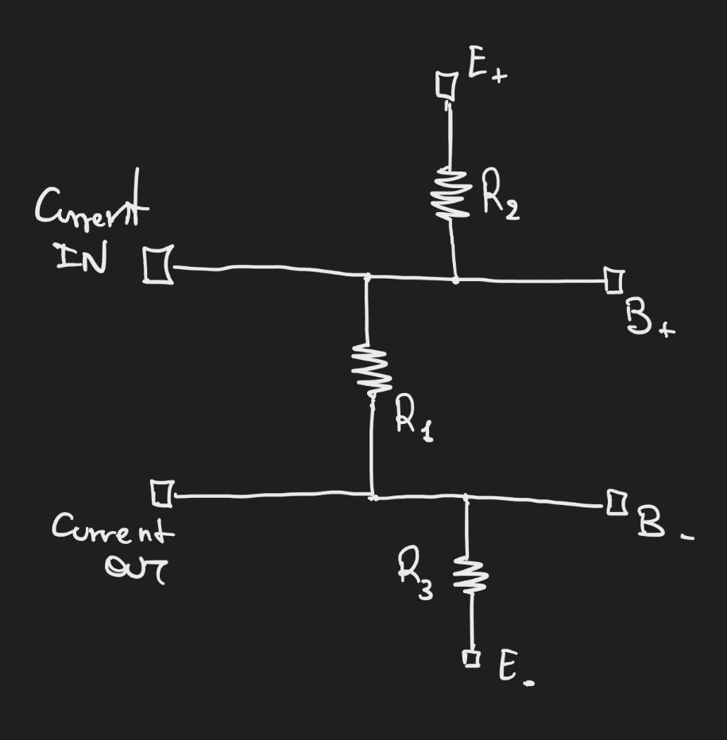
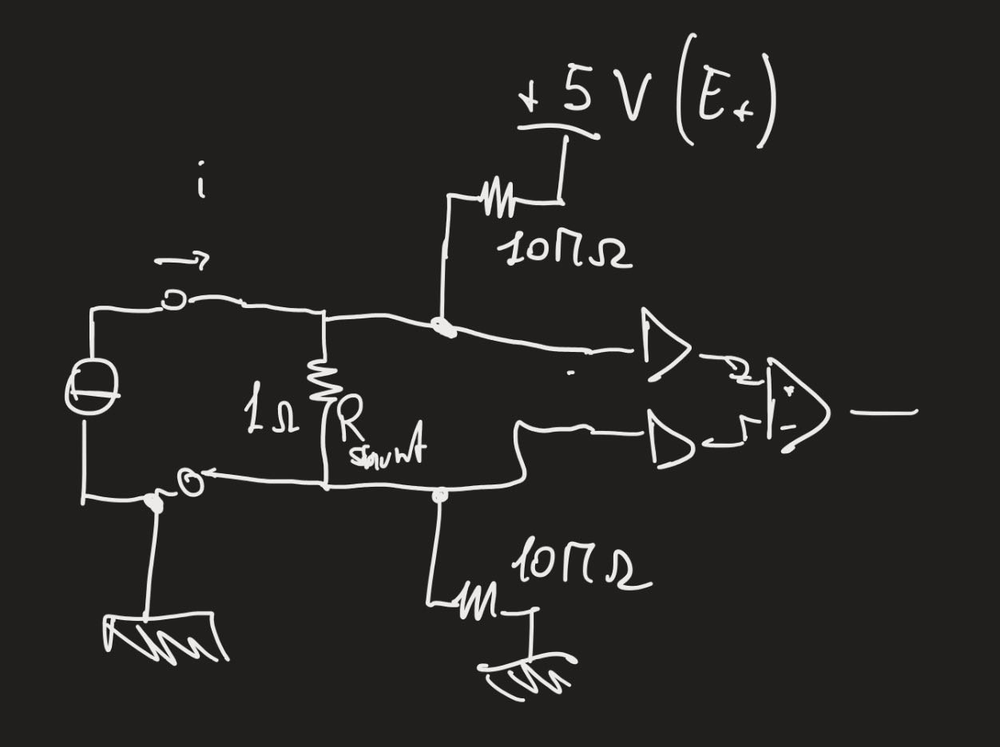
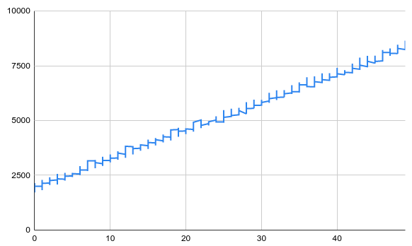
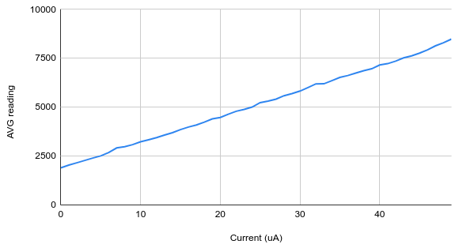

# Ampere Hunter

## Introduction.

Ampere Hunter is a project that has the aim of creating a simple tool to measure very small currents.
I have been experiencing the need of measuring microampere several times.
This is particularly useful when you deal with battery-powered IoT devices.

For instance: how could you make sure that an ESP32-based device will last for the intended battery life?
Consumption measurement is very important, especially if you plan to run your system on a single battery for months or years.

The target of the project is to put together something very simple that might provide guidance in the evaluation of the battery life.
The simplicity of the implementation introduces errors and inacuracies, but I hope that with the mutual contribution of who is interested the system can be improved over time.

## Hardware

When it comes to the components, the idea is to exploit as much as possible commercial components that are available on the most wellknown marketplaces.
The implementation should be very simple also in terms of interface.
My choice went for an ESP32 board as a controller and the HX711 as the sensing circuit.
You can find online several attempt of using the HX711 (which is used as a load cell amplifier) for current measurement.

The HX711 is connected to the ESP32 via DOUT and CLK pin and power supply from +5V and GND.
A shunt resistor on the B channel is used to sense the current. I have chosen 1 ohm.
Then E+ and E- are conneted to each side of the shunt resistor via two 10Mohm resistor to make sure that none of the input are left floating.

Find here below a simple schematic.

## Firmware

The firmware implementation is also very simple.
Data are collected from HX711 channel B.
(I have chosen to use channel B because it has a lower Gain and this brings about a wider sensing range. The Voltage range is also +-80mV when power supply is 5V.)
Then data is converted through linear conditioning to microampere and printed over the serial output.

Howevere, I have experienced difficulties at connecting the device to the PC USB and use the USB as power supply.
I suggest to use a separate common power bank to supply your system.
(this is not a good solution because the output voltage is variable on many inexpensive power bank. This is surely an improvement point for the future)
Since a separate power supply is needed, I have added a TCP client to stream data to a TCP server that you can easily setup on your own local network.
(If you have a linux PC this is enough "nc -l <port number>" , but ufw need to be allowed on the port you choose)
	
## Results

Here below some early result of measurement from the system.

